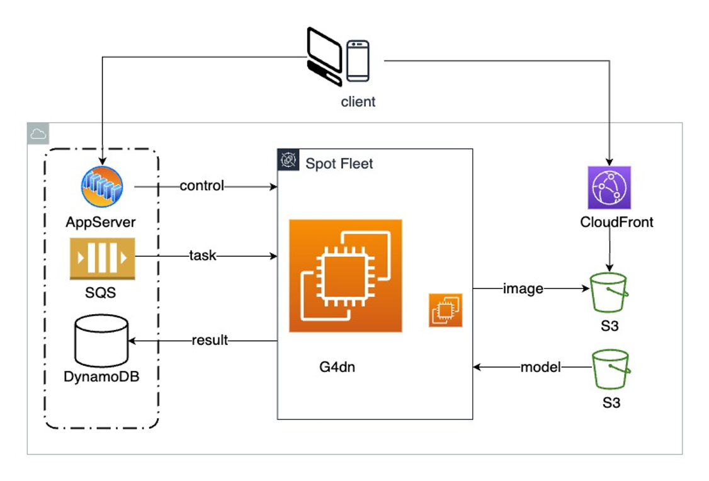

# Stable Diffusion Asynchronous Inference Service

[](README.md)
[](README.zh-CN.md)

Image inference based on large models is a time-consuming and resource-intensive process. For businesses to operate healthily and meet elastic user traffic under controllable costs, this project provides a viable solution by building an elastically scalable asynchronous inference cluster.

## Quick Start

The fastest way to deploy this solution is using AWS CDK:

```bash
# Clone the repository
git clone https://github.com/yourusername/sd-async-inference.git
cd sd-async-inference/cdk

# Install dependencies
npm install

# Deploy the infrastructure
./deploy.sh
```

For detailed deployment instructions, please refer to the [CDK Deployment Guide](./cdk/README.md).

## Architecture


This solution is built on AWS foundational services:
- Amazon API Gateway
- AWS Lambda
- Amazon SQS
- Amazon S3
- Amazon DynamoDB
- Amazon EC2 Auto Scaling Group

The architecture follows an asynchronous processing pattern:
1. Client submits inference tasks via API Gateway
2. Lambda processes requests and stores tasks in SQS and DynamoDB
3. EC2-based inference cluster processes tasks from SQS
4. Results are stored in S3 and accessible via CloudFront
5. Auto-scaling based on SQS queue metrics

## API Documentation

After successful deployment, the following APIs will be available:

### Submit Task (POST /task)
```bash
curl -X POST https://${APIGatewayID}.execute-api.${region}.amazonaws.com/task \
  -H "Content-Type: application/json" \
  -d '{"api":"/sdapi/v1/txt2img","payload":{"prompt":"your prompt here","steps":20}}'
```

### Query Task Status (GET /task)
```bash
GET https://${APIGatewayID}.execute-api.${region}.amazonaws.com/task?taskId=${taskId}
```

## Deployment Options

This project supports two deployment options for the inference cluster:

1. **EC2 Auto Scaling Group Deployment** - Recommended for production use
   - Containerized deployment with Docker
   - Gradual deployment with canary testing
   - Automatic rollback capability
   - Detailed monitoring and health checks
   - [Learn more about EC2 deployment](./server/api-scheduler/docs/deployment-guide.md)

2. **Basic Infrastructure Deployment** - Suitable for testing and development
   - Deploys only the core infrastructure components
   - Manual setup of inference instances required
   - [Basic deployment instructions](./cdk/README.md)

## Project Structure
- `cdk/`: AWS CDK infrastructure code and deployment scripts
- `server/`: Server-side components
  - `lambda/`: Lambda function code
  - `api-scheduler/`: Inference task scheduler
- `assets/`: Project resource files

## Component Documentation
- [API Scheduler Documentation](./server/api-scheduler/README.md)
- [Lambda Function Documentation](./server/lambda/task_handler/README.md)
- [CDK Deployment Guide](./cdk/README.md)

## Contributing
Pull Requests or Issues are welcome to help improve the project.

## License
This project is licensed under the MIT License.
